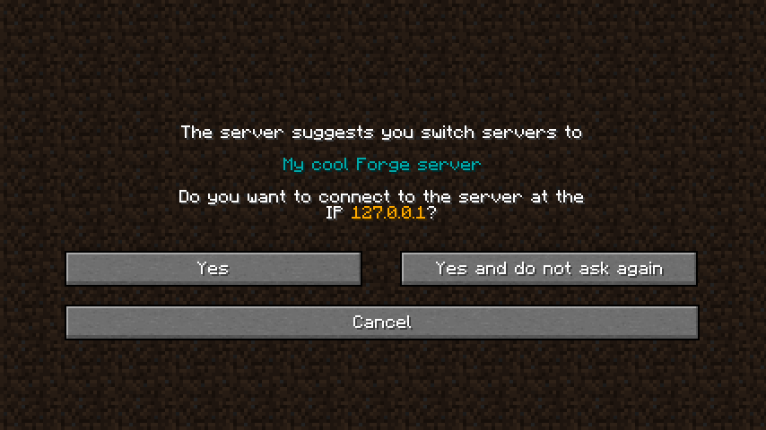

# ServerSwitchy

ServerSwitchy is a simple mod for Minecraft that allows your lobby server to direct the player to a different server.

## Usage
1. Install ServerSwitchy on the client.
2. Send a custom payload packet in the documented format to the client.
3. There is no step 3.

The mod can also be used on the server to enable a debug command (must be enabled in `serverswitchy-common.toml`):
- `/serverswitchy Dev 127.0.0.1 {"text": "Cool Server here"}`
- `/serverswitchy Dev 127.0.0.1 {"text": "Cool Server here"} true`

The last argument controls whether the confirmation screen is forced (see flags below). 

## Custom payload documentation
A custom payload packet must be sent on the `serverswitchy:main` channel.
The payload for this packet must contain 3 things:
1. The target IP and/or hostname (e.g. `example.com` or `127.0.0.1:12345`) using `FriendlyByteBuf#writeUtf`
2. The name for the target server, to be displayed to the client using `FriendlyByteBuf#writeComponent`
3. A 32-bit integer for flags using `FriendlyByteBuf#writeInt`. The following flags can be set:
   - `0b0001`: Force the client to show the confirmation screen, even if "do not ask again" had been selected previously

An example can be found in the [debug command source code](src/main/java/dev/weiland/mods/serverswitchy/ServerSwitchyCommands.java).